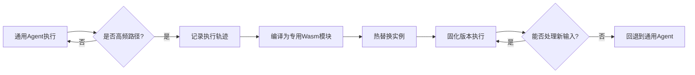

# 自研AI Agent运行时架构设计决策总结
## 1. 项目背景与设计目标
### 1.1 核心需求
+ **目标场景**：生产级多租户AI Agent服务平台，非个人助手
+ **业务特点**：强安全隔离、超高并发、长期运行、企业级SLA
+ **技术挑战**：既要实现毫秒级响应，又要保障租户间数据零泄漏

### 1.2 设计约束条件
| 约束维度 | 具体要求 |
| --- | --- |
| **安全隔离** | 多租户（数十万用户）之间零数据泄露 |
| **并发性能** | 单机支持≥10000活跃实例，冷启动≤5ms |
| **资源效率** | 每个实例内存开销≤64MB |
| **可用性** | 7×24运行，故障隔离，自动恢复 |
| **扩展性** | 支持水平扩展，便于Kubernetes编排 |


## 2. 技术选型决策记录
### 2.1 运行时选型决策
**备选方案对比**：

| 方案 | 隔离强度 | 启动时间 | 内存开销 | 生态兼容 | 决策 |
| --- | --- | --- | --- | --- | --- |
| **Docker容器** | 中等（共享内核） | 1-2秒 | 100MB+ | 优秀 | ❌ 启动慢、开销大 |
| **KVM微虚拟机** | 强（独立内核） | 0.5-1秒 | 100MB+ | 中等 | ❌ 启动慢、开销大 |
| **gVisor** | 中等 | 200-500ms | 50-100MB | 良好 | ❌ 仍有内核共享风险 |
| **WebAssembly** | 强（线性内存隔离） | 1-5ms | 1-10MB | 良好 | ✅ **选定** |


**选定理由**：

1. **Wasm线性内存模型**提供硬件级安全边界，指针无法跨实例逃逸
2. **极低启动成本**适合"每会话一实例"的高并发模式
3. **能力安全模型**天然支持最小权限原则，默认无任何系统能力

### 2.2 宿主语言决策
**备选语言对比**：

| 语言 | 性能 | 内存安全 | Wasm生态 | 异步支持 | 决策 |
| --- | --- | --- | --- | --- | --- |
| Rust | 最优（零开销） | 编译时保证 | 官方支持（wasmtime） | tokio成熟 | ✅ **选定** |
| Go | 优秀 | 运行时GC | 社区绑定 | 原生协程 | ❌ Wasm生态较弱 |
| C++ | 最优 | 手动管理 | 社区绑定 | 复杂 | ❌ 安全性依赖开发者 |
| Node.js | 中等 | 中等 | wasmer-node | 优秀 | ❌ 性能瓶颈明显 |


**选定理由**：

1. **Rust与wasmtime**组合有官方支持和最佳性能
2. **编译时内存安全**对宿主中介这种安全关键组件至关重要
3. **tokio异步运行时**适合高并发I/O密集型场景

### 2.3 存储与通信决策
**通信机制决策**：

```plain
外部流量 → Nginx/Envoy → 宿主网关 → 消息队列 → Wasm实例
(路径路由)(SessionID映射)(每个实例独立通道)
```

**存储方案决策**：

+ **会话状态**：Redis集群（低延迟，支持水平扩展）
+ **审计日志**：Elasticsearch（全文检索，模式分析）
+ **工具输出**：对象存储（如S3/MinIO，生命周期管理）
+ **配置文件**：本地YAML + etcd（分布式配置）

## 3. 核心架构设计决策
### 3.1 实例生命周期管理
**决策点**：如何高效管理数万个Wasm实例的生命周期

**方案选择**：

+ **预初始化池模式**：启动时创建N个"干净"实例（仅加载基础Agent字节码）
+ **动态热插拔**：会话建立时从池中取出实例，注入SessionID和配置
+ **状态重置与回收**：会话结束时重置实例状态，归还池中

**技术实现**：

```rust
struct InstancePool {
clean_instances: Vec<WasmInstance>,
active_sessions: DashMap<SessionId, ActiveInstance>,
semaphore: Semaphore,// 控制最大并发数
}
```

### 3.2 跨实例通信与隔离
**关键决策**：确保实例间通信绝对隔离

| 隔离维度 | 具体措施 | 实现方式 |
| --- | --- | --- |
| **内存隔离** | 线性内存硬边界 | wasmtime独立Memory对象 |
| **文件系统** | 预开目录映射 + 路径校验 | preopens + normalize_path校验 |
| **工具执行** | 子进程多级隔离 | user namespace + chroot + seccomp |
| **网络通信** | 白名单域名限制 | host_http_fetch函数内域名检查 |
| **消息路由** | 严格SessionID绑定 | 两级映射表：Conn→Session→Instance |


**路径安全决策**：

```rust
// 所有路径参数必须经过此函数验证
fn validate_path(path: &str, sandbox_root: &Path) -> Result<PathBuf> {
let normalized = normalize_path(path);// 移除..和.
let full_path = sandbox_root.join(normalized);
if !full_path.starts_with(sandbox_root) {
return Err("Path traversal detected");
}
Ok(full_path)
}
```

### 3.3 工具执行安全模型
**决策原则**：所有外部工具调用必须通过宿主中介，并执行安全校验

**三层防御机制**：

1. **能力白名单**：每个实例初始化时指定允许使用的工具列表
2. **参数校验**：所有路径参数标准化+沙箱边界检查
3. **进程隔离**：子进程运行在独立user namespace，chroot到沙箱目录

**审批机制决策**：

```plain
工具调用流程：
1. 实例请求执行工具 → 2. 宿主校验工具ID和参数 →
3. 可选：人工审批（高权限操作）→ 4. 创建隔离子进程执行 →
5. 记录审计日志（含session_id和工具签名）
```

### 3.4 性能优化决策
**JIT固化引擎决策**：

**问题**：某些高频路径（如"用户查询→调用API→格式化返回"）每次通过LLM推理产生不必要延迟

**解决方案**：实现轨迹记录→热路径编译→热替换机制

**工作流程**：



**固化触发条件**：

+ 同一工具序列连续执行≥10次
+ 执行耗时显著低于LLM推理
+ 输入模式相对固定

### 3.5 配置管理系统决策
**借鉴OpenClaw的设计**但进行多租户适配：

**分层配置结构**：

```yaml
# 全局配置 /etc/agent-runtime/config.yaml
global:
max_instances: 10000
default_memory_mb: 64
sandbox_base: "/data/sandboxes"

# 租户级配置（每个组织一个）
tenants:
acme-corp:
allowed_domains: ["api.acme.com"]
max_tool_timeout: 30
tools:
- id: 1
name: "internal-tool"
executable: "/opt/acme/tool"
requires_approval: true

# 会话级配置（运行时注入）
session:
session_id: "uuid"
user_context: {...}
allowed_tools: [1, 3, 5]# 仅允许预定义工具子集
```

**配置优先级**：会话级 > 租户级 > 全局级

## 4. 安全架构决策
### 4.1 多租户安全模型
**关键决策**：采用"完全实例隔离"而非"进程内命名空间隔离"

**理由**：

+ **攻击面最小化**：每个租户实例在独立线性内存空间
+ **故障域隔离**：一个实例崩溃不影响其他实例
+ **资源限制可执行**：可通过ResourceLimiter精确控制每个实例资源

**实现细节**：

+ 每个实例拥有独立的Memory对象和Table对象
+ 宿主函数调用时自动绑定当前实例上下文
+ 审计日志包含实例ID和会话ID的双重标识

### 4.2 认证与授权决策
**三层认证授权模型**：

| 层级 | 认证方式 | 授权范围 |
| --- | --- | --- |
| **接入层** | API Key/JWT | 租户身份验证 |
| **会话层** | Session Token | 访问特定Agent实例 |
| **操作层** | 运行时检查 | 工具执行权限 |


**最小权限实现**：

```rust
struct InstanceCapabilities {
can_read_files: Vec<PathPattern>,// 文件读取模式
can_exec_tools: Vec<ToolId>,// 允许的工具ID
can_network_to: Vec<DomainPattern>, // 网络访问白名单
max_memory_mb: u32,// 内存上限
max_compute_units: u64,// 计算单元限制
}
```

### 4.3 审计与监控决策
**审计策略**：

+ **全量记录**：所有宿主函数调用（参数脱敏）
+ **实时告警**：异常模式检测（如频繁尝试路径遍历）
+ **定期分析**：使用Elasticsearch进行安全态势分析

**监控指标**：

```yaml
监控维度:
- 实例数量: active_instances
- 资源使用: memory_used, cpu_time
- 安全事件: failed_attempts, permission_denied
- 性能指标: response_time_p99, tool_execution_time
```

## 5. 部署与扩展性决策
### 5.1 部署架构决策
**单机模式**：

```plain
单体宿主进程 + 本地存储
适合：小型部署，<1000并发实例
```

**集群模式**：

```plain
┌─────────────┐
│负载均衡器│
└──────┬──────┘
↓
┌──────────┐┌──────────┐┌──────────┐
│ 宿主节点1 ││ 宿主节点2 ││ 宿主节点3 │
└──────────┘└──────────┘└──────────┘
↓↓↓
┌─────────────────────────────────────┐
│共享存储 (Redis + S3)│
└─────────────────────────────────────┘
```

**水平扩展策略**：

+ **会话亲和性**：同一会话始终路由到同一宿主节点
+ **状态外部化**：会话状态存储在Redis中，支持节点故障转移
+ **动态伸缩**：基于实例数量和资源使用自动扩缩容

### 5.2 资源管理决策
**资源配额模型**：

```yaml
resource_quotas:
per_instance:
memory_mb: 64
cpu_shares: 100
max_tool_timeout: 30
network_bandwidth: "10Mbps"

per_tenant:
max_instances: 1000
total_memory_mb: 64000
requests_per_second: 1000
```

**过载保护机制**：

1. **准入控制**：超过配额拒绝新会话
2. **优雅降级**：高负载时延长工具执行超时
3. **优先级队列**：重要租户请求优先处理

## 6. 与OpenClaw的差异化决策
### 6.1 根本设计哲学差异
| 维度 | OpenClaw | 本方案 |
| --- | --- | --- |
| **信任模型** | 单一信任边界（个人主机） | 多租户零信任 |
| **隔离强度** | 进程级（通过OS用户隔离） | 内存级（Wasm线性内存） |
| **扩展目标** | 个人/小团队使用 | 企业级多租户SaaS |
| **部署密度** | 单机数十个实例 | 单机数万个实例 |
| **安全默认值** | 相对宽松（信任用户） | 极度严格（默认拒绝） |


### 6.2 可借鉴的设计模式
尽管目标不同，OpenClaw仍提供有价值的设计模式：

1. **插件化架构**：通过manifest声明的插件注册机制
2. **技能系统**：技能目录+指令模板的扩展模式
3. **配置管理**：分层配置和CLI管理工具
4. **审计工具**：`openclaw security audit`的安全扫描思路

## 7. 风险评估与缓解策略
### 7.1 已知风险与对策
| 风险点 | 影响 | 缓解策略 |
| --- | --- | --- |
| **Wasm运行时漏洞** | 高（可能逃逸） | 1. 及时更新wasmtime 2. 启用所有安全特性 3. 深度防御（多层隔离） |
| **路径遍历攻击** | 中 | 1. 严格的路径规范化 2. 符号链接跟踪 3. 审计日志分析 |
| **资源耗尽攻击** | 中 | 1. 严格的ResourceLimiter 2. 按租户配额限制 3. 实时监控告警 |
| **侧信道攻击** | 低 | 1. 实例CPU绑定 2. 缓存分区 3. 执行时间随机化 |


### 7.2 技术债务管理
**短期技术债务**：

+ JIT固化引擎复杂度
+ 多语言支持（Python/JS解释器）

**长期偿还计划**：

```plain
Phase 1: 核心Wasm运行时 + 基础安全
Phase 2: 性能优化 + JIT引擎原型
Phase 3: 多语言扩展 + 高级工具集
Phase 4: 生态建设 + 开发者工具
```

## 8. 实施路线图与里程碑
### 8.1 四阶段实施计划
**第一阶段：MVP核心（4-6周）**

```plain
交付物：
- 基础Wasm实例管理
- 宿主函数框架（文件、网络、日志）
- 路径安全校验工具执行器
- 单机1000并发验证
```

**第二阶段：生产就绪（4-6周）**

```plain
交付物：
- 预初始化实例池
- 完整的会话映射和网关路由
- 审计日志和监控系统
- 多租户配置管理
```

**第三阶段：性能优化（4-6周）**

```plain
交付物：
- JIT固化引擎原型
- 水平扩展支持（NATS + Redis）
- 资源配额和限制器
- 性能基准测试套件
```

**第四阶段：生态扩展（持续）**

```plain
交付物：
- Python/JS解释器组件
- 可视化监控控制台
- 开发者SDK和文档
- 第三方插件市场原型
```

### 8.2 成功度量标准
**技术指标**：

+ 冷启动时间 ≤5ms（P99）
+ 内存开销 ≤64MB/实例
+ 实例隔离有效性 100%（无数据泄露）
+ 系统可用性 ≥99.9%

**业务指标**：

+ 支持租户数 ≥100
+ 并发实例数 ≥10000
+ 平均响应时间 ≤50ms
+ 安全事件数 0（重大漏洞）

## 9. 结论与下一步行动
### 9.1 核心决策总结
1. **技术栈确定**：Rust + wasmtime + tokio组合提供最优性能与安全平衡
2. **架构模式选定**：预初始化池+热状态注入实现超高并发密度
3. **安全模型确立**：能力安全+多层防御+严格审计的多租户零信任模型
4. **扩展路径清晰**：从单机MVP到分布式集群的可演进架构

### 9.2 立即行动项
1. **搭建原型环境**：创建Rust项目，集成wasmtime 10.0+
2. **设计配置格式**：定义YAML配置结构和解析器
3. **实现第一个宿主函数**：从简单的文件读写入手，加入路径校验
4. **建立性能基准**：创建基准测试框架，跟踪关键指标
5. **安全评审计划**：安排第一次架构安全评审（2周内）

此文档已涵盖所有关键技术决策和架构选择，可作为与大模型进行脑暴的基础材料，用于产出正式的技术设计方案和详细实现计划。
